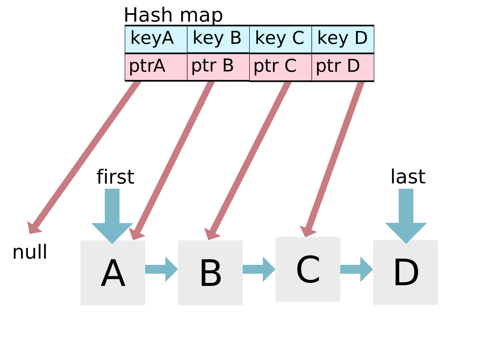
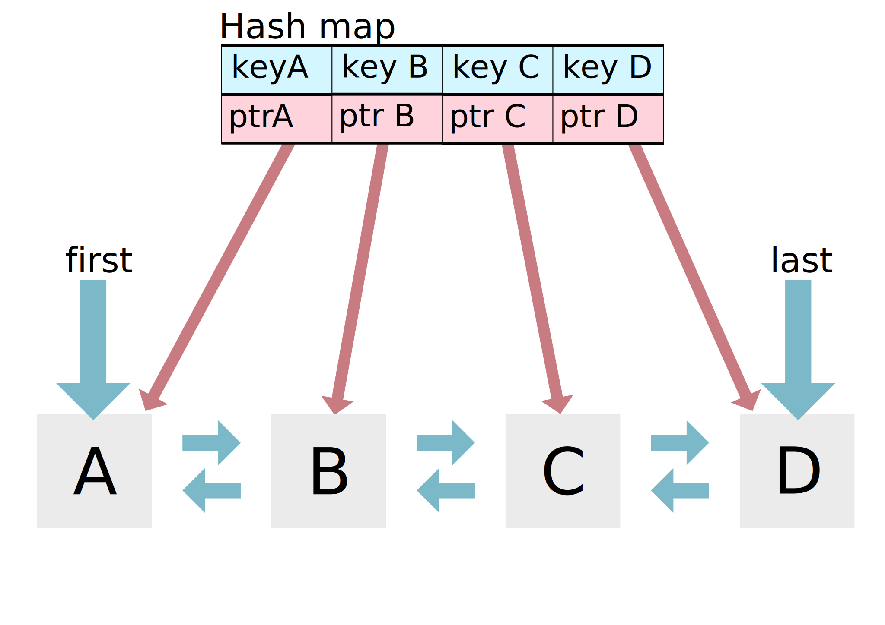

# LRU Cache using Singly Linked List & benchmarks

Do you believe a **doubly** linked list is required to implement LRU cache?

No! You need only **one-way** linked list to implement that!

## Data Structure

### LRU cache with Singly Linked List



### LRU cache with Doubly Linked List



## Implementation

Please see [src/LruCacheUsingSinglyLinkedList.ts](./src/LruCacheUsingSinglyLinkedList.ts)

A common implementation (using doubly linked list) is [here](./src/LruCacheUsingDoublyLinkedList.ts).

## Benchmark

Let's take a benchmark.

```bash
% npm run bench

> lru-cache-using-singly-cached-list@0.0.0 bench
> ts-node src/Benchmark.ts

Doubly Linked List x 238 ops/sec ±1.74% (80 runs sampled)
Sindly Linked List x 126 ops/sec ±1.54% (81 runs sampled)
[Done] Fastest: Doubly Linked List
```

Hmm... It looks the doubly linked list is faster. However, the singly linked list consumes less memory than the doubly linked list.
